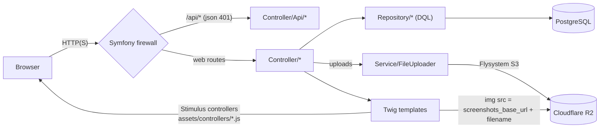
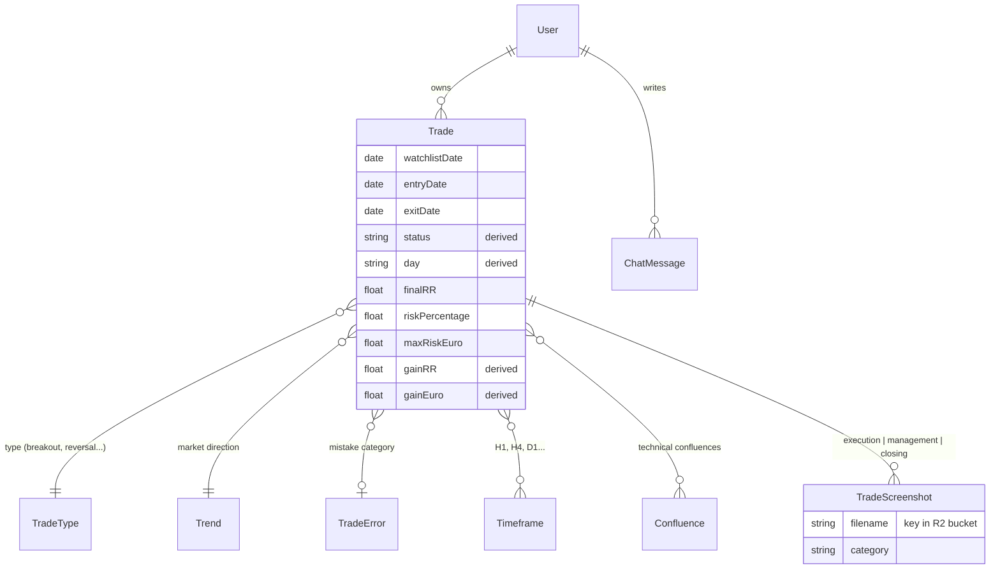
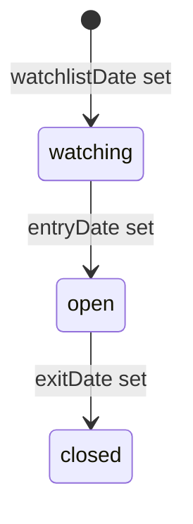
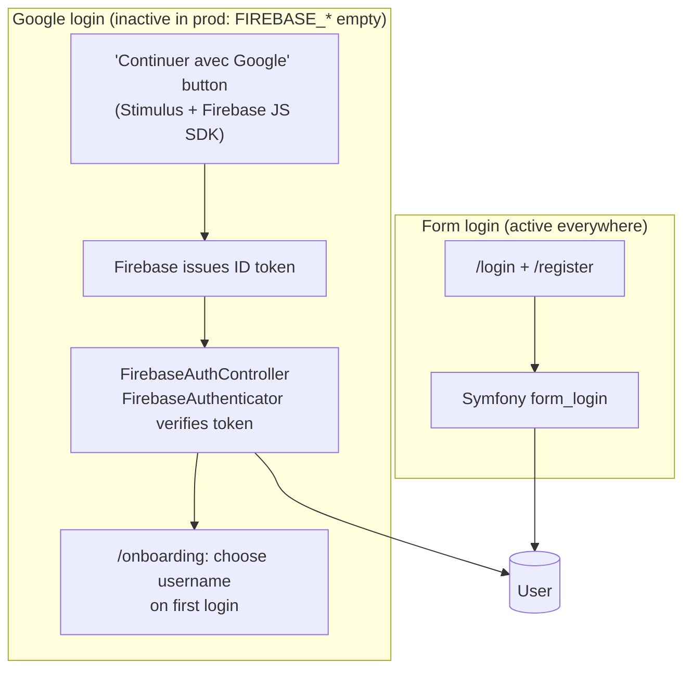
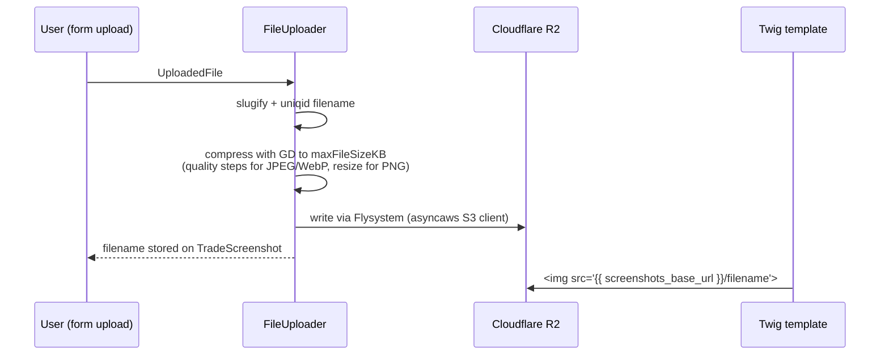

# Architecture

> **TL;DR for an AI**: Symfony 7.3 monolith (controllers + Twig + Stimulus), PostgreSQL
> via Doctrine. Core entity: `Trade`. Screenshots are stored on **Cloudflare R2**
> (Flysystem), not on local disk. Two auth paths: form login (email/password) and
> Firebase "Sign in with Google" (configured but inactive in prod). Production
> runbook: [PRODUCTION.md](PRODUCTION.md). REST API: [API.md](API.md).

## Stack

| Layer | Technology |
|---|---|
| Framework | Symfony 7.3 (PHP 8.x) |
| Database | PostgreSQL 15+ (dev) / 16 (prod) via Doctrine ORM |
| Templates | Twig (most page styles are inline in `templates/base.html.twig`) |
| Frontend interactivity | Stimulus.js + Hotwired Turbo (no SPA) |
| Asset pipeline | Symfony Asset Mapper (importmap, **no webpack/npm build step**) |
| CSS framework | Bootstrap 5.3 + bootstrap-icons (CDN) |
| Screenshot storage | Cloudflare R2 via Flysystem (`asyncaws` S3 adapter) |
| Google login | Firebase Authentication (`src/Security/Firebase/`) |

## Request flow



## Domain model



Standalone entities (no relations): **DailyNews** (generated by
`app:news:generate`, see `src/Command/GenerateDailyNewsCommand.php`) and
**CentralBank** (data behind the `/cycles` rate-cycle clock page).

### Trade lifecycle

A trade's `status` is never set directly — it derives from which dates are set:



### Calculated fields

Recalculated on save, never set directly:

| Field | Formula |
|---|---|
| `status` | derived from `entryDate` / `exitDate` (see above) |
| `day` | day-of-week of `entryDate` |
| `gainRR` | `finalRR × (riskPercentage / 100)` |
| `gainEuro` | `gainRR × maxRiskEuro` |

## Directory structure

```
src/
├── Command/            CreateAdminCommand, GenerateDailyNewsCommand
├── Controller/
│   ├── Admin/          ChatAdminController (support-chat back office)
│   ├── Api/            TradeApiController (REST, see docs/API.md)
│   ├── TradeController.php        core CRUD
│   ├── StatsController.php        analytics dashboard (/stats)
│   ├── CyclesController.php       central-bank rate cycles clock (/cycles)
│   ├── ChatController.php         support chat (/chat)
│   ├── NewsController.php         daily news (/news)
│   ├── SecurityController.php     form login/register
│   ├── FirebaseAuthController.php Google sign-in endpoint
│   ├── OnboardingController.php   username choice on first Google login
│   ├── ProfileController.php
│   └── {Confluence,Timeframe,TradeType,TradeError,Trend,Trader}Controller.php
├── DataFixtures/       ⚠ dev DB holds REAL data — load with --append ONLY
├── Entity/             11 Doctrine entities (attribute mapping)
├── Form/               Symfony form types
├── Repository/         custom DQL (TradeRepository powers /stats)
├── Security/
│   └── Firebase/       FirebaseAuthenticator + token verifier factory
└── Service/
    ├── FileUploader.php    compression (GD) + upload to R2
    └── StatsProvider.php

templates/              Twig, mirroring controllers; base.html.twig holds the
                        global inline CSS (font scale, navbar, cards...)
assets/controllers/     Stimulus controllers (chat, autocomplete...)
config/packages/        flysystem.yaml (R2), twig.yaml (globals), security.yaml
docker/                 entrypoint.sh + nginx/default.conf (prod)
docs/                   this documentation
migrations/             Doctrine migrations
```

## Authentication

Two entry paths, one `User` entity (email = identifier):



- **Roles**: `ROLE_USER` (required on all protected routes), `ROLE_ADMIN`
  (also grants premium), `ROLE_MODERATOR`, `ROLE_TRADER`.
- **Premium** (currently = admin): screenshots up to 500 KB at quality 90;
  free users 20 KB at quality 10.
- **Firewalls**: `dev` (profiler/assets, open), `api` (`/api/*`, JSON 401),
  `main` (everything else, redirects to `/login`).
- ⚠ Only one real user account matters (id=2) and its email is fictitious —
  careful with any auth logic that matches users by email.

## Screenshots (Cloudflare R2)

Screenshots are **not** stored in `public/uploads/` anymore; they live in the
R2 bucket and are served directly from R2's public URL:



Configuration: `config/packages/flysystem.yaml` (bucket) +
`config/services.yaml` (S3 client: `R2_ENDPOINT`, `R2_ACCESS_KEY_ID`,
`R2_SECRET_ACCESS_KEY`) + `SCREENSHOTS_BASE_URL` exposed as the Twig global
`screenshots_base_url`.

## Statistics

`TradeRepository` provides the queries behind `StatsController`:
`getStatistics()` (totals, win rate, avg P&L), `getChartData()` (cumulative
P&L time series), `getConfluenceStats()`, `getDayStats()`. All accept a
`filters` array: `user`, `start_date`, `end_date`, `confluences`.

## Key web routes

| Path | Feature |
|---|---|
| `/` | Landing page |
| `/login`, `/register` | Form auth |
| `/trade`, `/trade/new`, `/trade/{id}`, `/trade/{id}/edit` | Trade CRUD |
| `/stats` | Analytics dashboard |
| `/cycles` | Central-bank rate cycles clock |
| `/chat` | Support chat (admin side under `Controller/Admin/`) |
| `/news` | Daily news |
| `/trade-type`, `/trend`, `/confluence`, `/timeframe`, `/trade-error` | Reference-entity CRUD |
| `/api/*` | REST API — see [API.md](API.md) |
