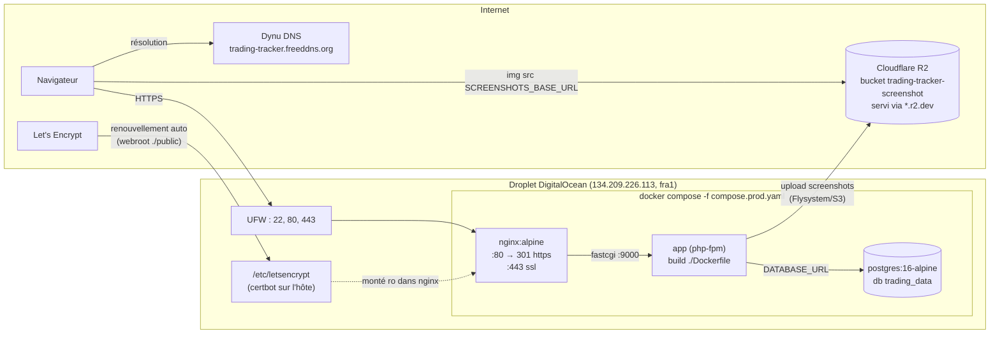
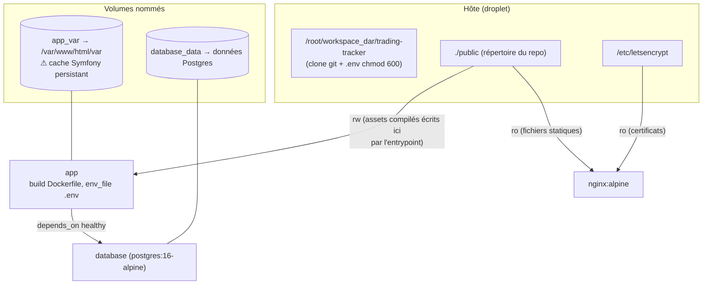
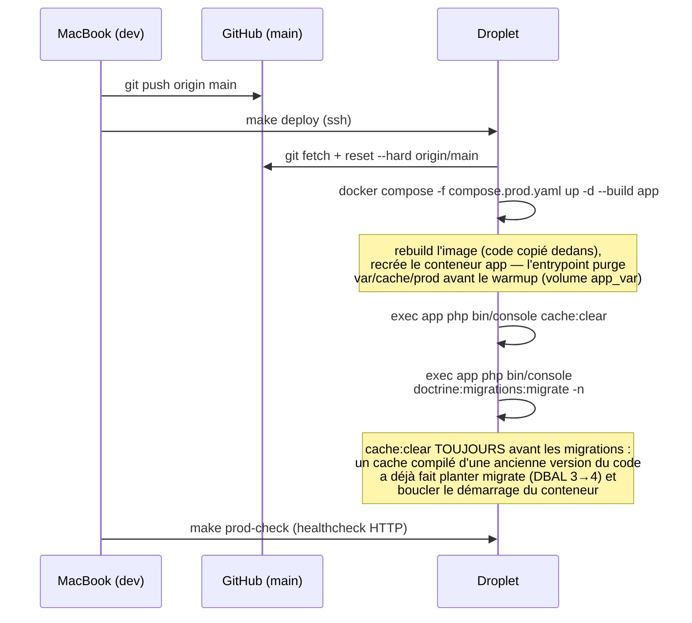
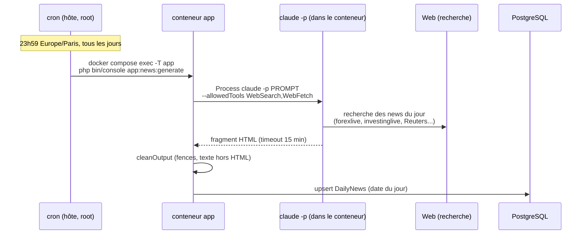

# Production — Runbook

> **TL;DR pour une IA** : la prod tourne sur un droplet DigitalOcean derrière
> **https://trading-tracker.freeddns.org** (SSL Let's Encrypt actif, renouvellement
> automatique). Accès : `ssh droplet` depuis la machine de dev. Pour déployer un
> changement de code : **`make deploy`** (reset sur origin/main + rebuild du
> conteneur `app` + migrations + **`cache:clear` obligatoire** + healthcheck,
> voir [Déployer](#déployer-un-changement)). Les secrets sont dans
> `/root/workspace_dar/trading-tracker/.env` sur le droplet (jamais commité).
> Un cron (23h59 Europe/Paris) génère le wrap news quotidien via `claude -p`
> dans le conteneur app — voir [News quotidiennes](#news-quotidiennes-cron).

## Vue d'ensemble



## Environnements

| | Prod (droplet) | Dev local (MacBook) | Mac mini (ancien) |
|---|---|---|---|
| URL | https://trading-tracker.freeddns.org | http://localhost:8001 (`make run`) | http://192.168.1.53 (LAN uniquement) |
| Statut | **Prod principale** | Développement | Obsolète, remplacé par le droplet |
| Accès shell | `ssh droplet` | — | `ssh macmini` |
| Base | postgres:16-alpine (conteneur) | PostgreSQL local (`trading_data`) | postgres:16-alpine (conteneur) |
| Données | Copie des données réelles (15/09/2026) | **Données réelles** (voir avertissement fixtures) | Copie des données réelles (15/09/2026) |

Le déploiement Mac mini (Colima, ACLs Tailscale bloquantes, port 80 non ouvert) a
été abandonné au profit du droplet ; le plan historique reste dans
[plans/macmini-deployment.md](plans/macmini-deployment.md).

## Le droplet

- Ubuntu 24.04, 1 vCPU / 1 Go RAM / 24 Go disque, région `fra1`
- **Swap 2 Go** (persisté dans `/etc/fstab`, `vm.swappiness=10`) — indispensable :
  sans swap, `docker build` est tué par l'OOM killer avec 1 Go de RAM
- Docker 29 + Compose v2 installés via apt (`docker.io`, `docker-compose-v2`),
  service activé au boot ; conteneurs en `restart: unless-stopped`
- UFW actif : uniquement OpenSSH, 80/tcp, 443/tcp
- Repo : `/root/workspace_dar/trading-tracker` (clone HTTPS du repo public)

## Domaine et SSL

- Domaine gratuit **Dynu** : `trading-tracker.freeddns.org` → `134.209.226.113`.
  L'IP du droplet est fixe, donc **pas de client DDNS ni de cron de mise à jour**
  (contrairement à ce que prévoyait le plan Mac mini).
- Certificat Let's Encrypt obtenu par `certbot certonly --webroot -w .../public`
  (le challenge ACME passe par nginx qui sert déjà `./public`, aucune coupure).
- Renouvellement automatique : timer systemd `certbot.timer` + hook
  `/etc/letsencrypt/renewal-hooks/deploy/reload-nginx.sh` qui exécute
  `docker exec trading-tracker-nginx-1 nginx -s reload`. Dry-run validé.
- nginx ([docker/nginx/default.conf](../docker/nginx/default.conf)) : port 80 =
  redirection 301 vers HTTPS **sauf** `/.well-known/acme-challenge/` (nécessaire
  aux renouvellements) ; port 443 = ssl + fastcgi vers `app:9000`.

## Stack Docker (compose.prod.yaml)



Points clés :

- Le code applicatif est **copié dans l'image** au build (voir
  [Dockerfile](../Dockerfile)) — un `git pull` sur l'hôte ne suffit **pas** à
  mettre à jour l'app qui tourne, il faut rebuilder.
- Exception : `./public` est un bind mount partagé — l'entrypoint du conteneur
  app ([docker/entrypoint.sh](../docker/entrypoint.sh)) exécute `cache:warmup`,
  `assets:install` et `asset-map:compile`, ce qui écrit les assets compilés dans
  le `public/` de l'hôte, où nginx les sert directement.
- `var/` vit dans le volume nommé `app_var` : **le cache Twig compilé survit aux
  rebuilds**. D'où le piège ci-dessous.

## Déployer un changement



**Commande unique (depuis la machine de dev ou un runner CI/CD)** :

```bash
make deploy
```

Cette cible du [Makefile](../Makefile) enchaîne, via SSH : `git fetch` +
`git reset --hard origin/main` (idempotent, insensible aux réécritures
d'historique — contrairement à `git pull`), rebuild du conteneur `app`,
`doctrine:migrations:migrate -n`, `cache:clear`, puis un healthcheck HTTP sur
l'URL publique. Variables surchargables pour la CI :
`make deploy PROD_SSH=root@134.209.226.113 PROD_DIR=/root/workspace_dar/trading-tracker`.

Autres cibles prod du Makefile (`make help` pour la liste complète) :

| Cible | Usage |
|---|---|
| `make prod-check` | healthcheck HTTP de la prod |
| `make prod-cache-clear` | vider le cache Symfony (le piège du volume `app_var`) |
| `make prod-migrate` | appliquer les migrations Doctrine |
| `make prod-nginx-reload` | changement de `docker/nginx/default.conf` seul : pas de rebuild, simple recreate (bind mount) |
| `make prod-ps` / `make prod-logs` | état / logs des conteneurs |
| `make prod-shell` | shell dans le conteneur app |
| `make prod-console CMD="..."` | commande `bin/console` arbitraire en prod |
| `make prod-snapshot` | dump SQL de la base de prod dans `snapshots/` (jamais commité) |

Les builds prennent plusieurs minutes (1 vCPU + swap) — c'est normal.

### Déploiement avec migration de base de données

⚠ **La base de prod contient les vraies données de trading.** Avant tout
déploiement qui embarque une migration Doctrine, prendre un snapshot :

```bash
make prod-snapshot     # dump SQL de la prod, rapatrié dans snapshots/ (filet de sécurité)
git push origin main
make deploy            # joue automatiquement doctrine:migrations:migrate -n + cache:clear
make prod-check
```

Règles pour écrire une migration sûre :

- **Additive de préférence** : `ADD COLUMN ... DEFAULT NULL` ne touche aucune
  ligne existante — c'est le cas idéal, déployable sans crainte.
- **Jamais de `DROP`, `ALTER TYPE` ou `UPDATE` massif** sans snapshot préalable
  et sans avoir testé la migration en local d'abord (`symfony console
  doctrine:migrations:migrate`) — la base locale contient les mêmes données
  réelles, c'est la répétition générale.
- Le `down()` doit rester cohérent (rollback possible), mais un `down()` qui
  droppe une colonne perd les données de cette colonne : le snapshot reste le
  seul vrai retour arrière.
- Doctrine ne rejoue que les migrations manquantes (table
  `doctrine_migration_versions`) : `make deploy` est idempotent.

🚫 **Le dossier `snapshots/` et tout dump `.sql` ne doivent JAMAIS être
commités** : le repo est public et les dumps contiennent les vraies données de
trading. Le `.gitignore` couvre `snapshots/` et `*.sql`, ne pas contourner
(`git add -f` interdit).

## Variables d'environnement (prod)

Le `.env` prod vit sur le droplet (`chmod 600`, **jamais commité** — le
`compose.prod.yaml` le charge via `env_file`). Variables attendues :

| Variable | Rôle |
|---|---|
| `APP_ENV` | `prod` |
| `APP_SECRET` | généré sur le droplet, différent des autres environnements |
| `DATABASE_URL` | `postgresql://trading_user:…@database:5432/trading_data?serverVersion=16&charset=utf8` |
| `POSTGRES_PASSWORD` | doit correspondre au mot de passe de `DATABASE_URL` |
| `FIREBASE_API_KEY` / `FIREBASE_AUTH_DOMAIN` / `FIREBASE_PROJECT_ID` / `FIREBASE_CREDENTIALS` | **vides en prod** → le bouton « Continuer avec Google » est inactif |
| `R2_BUCKET` / `R2_ENDPOINT` / `R2_ACCESS_KEY_ID` / `R2_SECRET_ACCESS_KEY` | stockage des screenshots sur Cloudflare R2 |
| `SCREENSHOTS_BASE_URL` | URL publique `*.r2.dev` du bucket, injectée comme global Twig |
| `CLAUDE_CODE_OAUTH_TOKEN` | auth headless de Claude Code pour `app:news:generate` (généré via `claude setup-token`) |
| `SENTRY_DSN` | monitoring d'erreurs Sentry (plan gratuit, alertes email) — vide = désactivé ; DSN du projet sur sentry.io → Settings → Client Keys |

Le [Dockerfile](../Dockerfile) écrit un `.env` **stub** (valeurs factices) dans
l'image, uniquement pour que `composer install` et `importmap:install` passent au
build ; à l'exécution, `env_file` écrase tout avec les vraies valeurs.

## News quotidiennes (cron)

La commande `app:news:generate` (voir
[GenerateDailyNewsCommand](../src/Command/GenerateDailyNewsCommand.php)) génère
le wrap de news du jour en lançant `claude -p` avec recherche web, puis
l'enregistre dans l'entité `DailyNews` (page `/news`). **En place et actif
depuis le 15/09/2026.**



Les briques :

- **Claude Code est installé dans l'image Docker** (voir
  [Dockerfile](../Dockerfile)) : `nodejs` + `@anthropic-ai/claude-code`, avec le
  `ripgrep` système (`USE_BUILTIN_RIPGREP=0`, le binaire embarqué est glibc et
  l'image est musl/Alpine). Conséquence : le build de l'image est plus long
  (installation de Node sur 1 vCPU) — choix assumé, ~1 build/semaine.
- **Auth headless** : `CLAUDE_CODE_OAUTH_TOKEN` dans le `.env` du droplet
  (chargé dans le conteneur via `env_file`). Le token se génère une fois, en
  interactif, avec `claude setup-token` (sur n'importe quelle machine) — jamais
  commité. ⚠ Après avoir ajouté/changé le token dans `.env`, recréer le
  conteneur (`docker compose -f compose.prod.yaml up -d app`) : `exec` utilise
  l'environnement figé à la création du conteneur.
- **Timezone** : le droplet est en **Europe/Paris** (`timedatectl
  set-timezone`, fait le 15/09/2026) pour que le cron parte bien à 23h59 heure
  française et que la date du wrap soit le jour français.
- **Cron** installé dans la crontab de root sur l'hôte (`crontab -l` pour
  vérifier, `crontab -e` pour modifier) :

```cron
59 23 * * * cd /root/workspace_dar/trading-tracker && docker compose -f compose.prod.yaml exec -T app php bin/console app:news:generate >> /var/log/news-cron.log 2>&1
```

Opérations courantes :

| Besoin | Commande |
|---|---|
| Générer/regénérer un jour précis | `make prod-console CMD="app:news:generate --date=2026-09-14"` (idempotent : remplace le wrap existant) |
| Vérifier la dernière exécution du cron | `ssh droplet 'tail -50 /var/log/news-cron.log'` |
| Tester la chaîne manuellement | `make prod-console CMD="app:news:generate"` |

La génération prend plusieurs minutes par jour (recherche web + rédaction,
timeout 15 min dans la commande) — normal, ne pas s'inquiéter du délai.

## Données

- Données réelles migrées depuis la base locale le 15/09/2026 (267 trades,
  7 users, 138 screenshots) via dump SQL `--data-only --inserts`.
- Migrations Doctrine au niveau `Version20260906000001` à cette date.
- Snapshot local : `make snapshot` (lit `DATABASE_URL` dans `.env.local`/`.env`,
  écrit dans `snapshots/`). **Ne jamais commiter un dump SQL.**

## Historique et pièges connus

- **Historique git réécrit 2× le 15/09/2026** (`git-filter-repo`, force push) pour
  purger des clés R2 et un mot de passe Postgres local. Tous les hash antérieurs
  ont changé. Tout clone datant d'avant doit être re-cloné ou réaligné avec
  `git fetch && git reset --hard origin/main` — **jamais `git pull`** (ça
  fusionnerait l'ancien historique avec le nouveau).
- Le repo est **public** : rien de sensible ne doit entrer dans un commit
  (`.env*`, dumps SQL, clés dans la doc — c'est déjà arrivé, d'où la réécriture).
- Rotation des clés R2 recommandée (elles ont été visibles publiquement avant la
  purge) — action côté dashboard Cloudflare.

## Dépannage rapide

| Symptôme | Cause probable | Remède |
|---|---|---|
| Un changement de template ne s'affiche pas | Cache Twig dans `app_var` | `exec app php bin/console cache:clear` |
| Un changement de code PHP ne s'applique pas | Le code est copié dans l'image | rebuild : `up -d --build app` |
| `docker build` échoue/tué sur le droplet | Swap absent ou plein | vérifier `swapon --show` (2 Go attendus) |
| Certificat expiré | Timer certbot ou hook en panne | `certbot renew --dry-run`, vérifier le hook `reload-nginx.sh` |
| 502 sur le site | conteneur app down | `docker compose -f compose.prod.yaml ps` puis `logs app` |
| Login Google ne marche pas en prod | `FIREBASE_*` vides — état normal actuel | renseigner les variables dans le `.env` du droplet |
| Pas de wrap news ce matin sur `/news` | cron en échec cette nuit | `tail /var/log/news-cron.log` ; regénérer : `make prod-console CMD="app:news:generate --date=YYYY-MM-DD"` |
| `Binaire "claude" introuvable` | image buildée avant le 15/09/2026 | `make deploy` (rebuild) |
| `claude -p` échoue en auth | `CLAUDE_CODE_OAUTH_TOKEN` absent/révoqué, ou conteneur pas recréé après ajout | vérifier le `.env`, régénérer via `claude setup-token`, puis `up -d app` |
